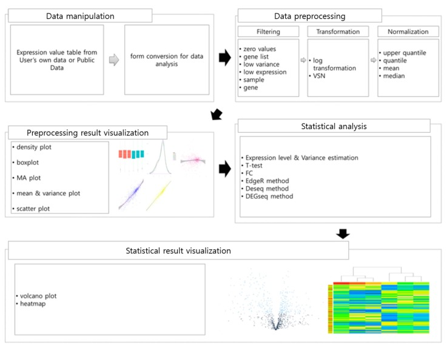

# Multigroup analysis

Abstract: Idea is to provide an easy to use API to process and analyze Quantitative mass spectrometry data from different sources.

## Aims

- Single configuration script, object allowing to specify filtering, imputation, normalization methods, models used, visualizations
- Generate output Report, including figure captions, in HTML and PDF format. Place all figures with reasonable naming in high res png and pdf in folders.
- Allow for variable column naming
     - change column names depending on input software and allow for meaningful column names for factors, conditions.
- Ensure that naming is consistent within analysis.
- Report p-values and adjusted p-values but more importantly report confidence or credibility intervals.
- Provide statistics of fold changes for multiple comparison experiments
- Support data on protein, peptide/precursor and transition level (likely peptide/precursor level only).
     - use filtering and aggregation on levels if statistics backend does not support those levels (e.g. limma)
- Support algorithms working on the precursor (MSStats and MapDIA), peptide (msqrob) and protein level (limma).
- Visualize up to 2 explanatory variables e.g. condition, patient. - This also means that the plots need to be annotated.
- Define comparisons using contrasts i.e. condition1 vs condition2
- Model fractionated experiments i.e. LOPID experiments
- create analysis compatible summaries each set of parameters to make metaanalysis possible:
    - Study parameter sensitivity - which step in the analysis changes the result most.
    - Benchmark datasets.

## Functionality:

### Data processing summaries

* How many conditions, How many samples per condition (2x2 tables).
* How many transitions, proteins, peptides, precursors at each filtering step.

### Generate QC plots for the data:
* Scatter plot within condition
    - on which level - Precursor, protein
    - on which condition if up to 3 conditions possible - main condition
* Pairsplot of group averages (output of modeling actually)
* Compare ording of transitions, proteins between samples
    * Correlation plot for samples - on which level - precursor protein or on all?
    * Pearson, Spearman, R or R^2
    * Compare clustering based on Correlation with that obtained from annotation.
* CV for each condition if N > 2 and overall.
    - How to interpret it in a paired experiment? 
    - Maybe disable it? Or show 2 CV plots based on each condition variable.
    - more concise represnetation?
* Intensity distribution within sample:
    * Violin - Densities within condition - before and after normalization
    * Compare condition based on common density - before and after normalization
    * How to compare 2 empirical distribution using on number?
        * Plot 5 number summaries - plot Q1, mean, median, Q3 for each sample.
        * Use moments mean, median, sd, Skewness, Kurtosis.
        * Show this summary before and after normalization.
* Clustering - heatmap, on not normalized and normalized data with condition labels:
    - specify which variables to encode - work out how to encode - color scheme.
* Summaries for NAs.
    * nr of NA's per sample on which level (precursor, protein)?
    * nr of NA's per precursor, peptide, protein
* Peptide and transition Summaries
    * Summaries of Charge states
    * Nr of precursors per modsequence
    * Nr of mod sequences per peptide
    * Nr of peptides per protein
    * Nr of proteins with 1,2,3, or peptides / precursors
* QC for Retention time (RT) only possible on precursor level data.
   * Plot pairwise precursor fold change vs RT.
   * Think about a summary for each pair?
      * Fit a loess line, moving average or spline. Report systematic deviations.
* MA plots on various levels
   * Log2 fold change vs intensity for precursors, aggregated peptides, and proteins.
   * Summarize their distribution - interesting because fold changes on precursor level sometimes much higher than on protein level.
* QC of data filtering
    - use sample correlation
    - use transition and peptide correlation

## Data preprocessing:
* data filtering
    - based on intensity : top X transitions per precursor, top X precursors per protein
    - correlation based precursor or peptide filtering
         - can be performed on normalized and not normalized data. What is the consequence?
         - Measure which combines correlation and scale. 
             - i.e. it does not matter if transitions not correlated if observed fold change are very small.
    - NA counting and removal, globally and per condition thresholds - how to specify it?
    - Q value filtering for DIA data (strongly related to NA filtering)
    - Protein filtering min X precursors, modified peptide sequences or peptides per protein
    - remove / keep not proteotypic peptides
* data aggregation (protein from precursors, and precursors from transitions)
    - using sum, mean median
* data normalization
    - vsn
    - median
    - median and variance
    - quantile
    - Tuckey median polish, what for: https://www.youtube.com/watch?v=RtC9ZMOYgk8
* Missing value imputation - must be used if aggregating is enabled and NA's in the data
    - sparse from Spectronaut
    - row mean and column mean imputation
    - linear regression
    - hot deck encoding
* Data modeling:
     * ANOVA
     * linear models
     * mixed linear models
     * external packages like _limma_ and _msqrob_ (eventually MSStats) on the data.

## Visualization of modeling results.

* Global for all proteins for 2 samples:
     * ma plot for each comparison - color code p-values?
     * volcano plot for each comparison (p-values, adjusted p-values)
     * distribution of p-values and distribution of adjusted p-values (FDR)
* For multiple comparisons
     * Scatterplot of fold changes
     * Correlation matrix for fold changes
     * Heatmap of significant fold changes
* Local (for each protein)
   * boxplot per condition for each protein (unpaired)
   * matrix plot showing all precursors / peptides.
   * Show confidence intervals.

# Open topics:

## Compare results for fold change obtained by:

$$
FC_{aggr} = log(\frac{a_1+b_1}{a_2+b_2})
$$
$$
FC_{transitions} = (log(\frac{a_1}{a_2})) + log(\frac{b_1}{b_2}))/2
$$


## Protein inference problem

We measure precursor, but the subject is proteins. Precursors can be grouped in proteins. Either, unambiguously (N:1) no conflicting peptide protein assignments, achieved by removing all precursors matching more than one protein.  Optionally we can allow for ambiguity (N:M), which means that the same peptide can be assigned to more than one protein.

- Visualize profiles of proteins which have shared peptides.
- Protein Grouping problem -> Visualize protein profiles of grouped proteins.

# Implementation

- Use long format (tibble) as long as possible and implement functions to switch from wide to long.
- Use an additional object which describes which columns means what? 
    - Store it in a tibble attribute.
- methods work on _tibble's_ and should support _magrittr_ operator
- Use tibbles to represent transition, precursor and protein/peptide.
     - those tibbles should have types since some methods are only applicable to transitions, precursors, peptides and proteins.
- Optional tibble to represent annotation if annotation largish.
- allow for switching between long and wide format (if wide store long format in an tibble attribute).
- (sf)[https://github.com/r-spatial]
- 
## Configuration

### What variables are needed for filtering?

- fixed effects, mayor effect e.g. condition, donor, sex
- subject e.g. Subject = TopProteinID or Subject = StrippedPeptideID or Subject = ModifiedProteinSequence
- subjectComponents e.g. Level_0 = "strippedSequence", Level_1 = "modifiedSequence", Level_3 = c("modifiedSequence", "charge", "precursorID")
- Specify `Response = "vsnIntensity"`

__Examples:__


Describe levels, 

```{r}
Effects = list(c("Strain", "Treatment", "TimePoint"), "PatientID", "isFemale")
```

If not named that create name by using default separator "_". E.g. Strain_Treatment_TimePoint
If named than use this name.

```{r}
Effects = list("Condition" = c("Strain", "Treatment", "TimePoint"), "Donor" = "PatientID", "Sex" = "isFemale")
```


Open issue: How do we merge the Condition columns into a new condition identifier? 
Needed for specifying contrasts.


A peptide measurment experiment

```{r}
Subject = "modifiedSequnce"
SubjectComponents = list("Precursor" = c("modifiedSequence", "charge", "precursorID"))
```

Order matters. The first entry in the list fixedEffects is the mainEffect.


A protein Measurement experiment

```{r}
Subject = "ProteinID"
SubjectComponents = list("Peptide" = c("nakedSequence"), "ModifiedPeptide" = c("nakedSequence", "modifidPeptideSequence"))
```

Similarily for experiments containing Precursor information.

### What configuration is needed for modeling?

We want to learn about proteins, therefore we need to specify:

```{r} 
Subject = "ProteinID"
fixedEffects = c("Condition", "Donor")
randomEffects = c(SubjectComponents, "Sex" = "isFemale")
Response = "vsnIntensity"
```


The ProteinID is here the grouping variable. Obsolete columns can be e.g. __Fasta.headers__ containing additional information. But obsolete can be also original intensities if transformed intensities are used. The transformed intensity will be the response. We limit the number of fixed effects to 3.

Do we need to specify those columns?

```{r}
ObsoleteColumns  = c("FastaHeaders") #(but required to be cept)
```

## What configuration is needed for plotting?

Most of the plots will work with the long format (ggplot2) but some of the plots need the data in a wide format (e.g. pairs plot).


## Aggregation and Correlation Filtering

uses information from the `subjectComponents`.
Aggregation and filtering works between subjectComponent and subject or 2 subjectComponent levels.


## Output

* modelling results
    - Subject 
    - Contrast
    - foldChange 
    - p-value 
    - adjusted-pvalue
    - obsolete columns (i.e fasta.headers).
    - Confidence interval

* subject statistics
    - Subject
    - nr of peptides
    - nr of precursors
    - mean subjectComponent correlation

* transformation results:
    - Subject, Sample, Intensity

* do also export all intermediate results.    

## Evaluation

* How filtering is influenced by the number of samples/conditions?
* How one filtering step can influence a different filtering step? E.g. stronger qValue filtering might in the increase number of proteins left because more are kept after correlation filtering.

# Types of input data :

- OpenSwath
- MaxQuant ProteinGroups.txt , Peptide.txt
- Spectronaut
- PD - LFQ workflow

# Example Projects

## Benchmar dataset 3 proteome
Check with Pedro Navarro if triple proteome datasets are available for various instruments.

## Example project Fabienne Cells.

## Example project 2147

factors - levels

* Raw.file
* Measurement.Date
* Measurement.Order
* Strain
* Timepoint
* Treatment
* Plant
* Leave
* BATCH

## fixed effects

interesting to the analysis

* Condition (Strain + Timepoint + Treatment)
* Since the experiment is paired we also need plant as an additional factor

## Random effects

Of no interest to the analysis, in this case, this would be the batch. If we move to protein level it will be peptide or precursor.

## Contrasts

Are computed based on a single factor - condition. Which can be a composition of several factors (see above).

## Protein Level Annotation

We are interested in inferences on the protein or protein groups level usually.

* Nr.Peptides
* Majority.protein.IDs (all proteins belonging to a protein group. See protein grouping  <http://aggrivet.blogspot.ch/2016/12/protein-clusters.html>.
* Top.Protein.Name - label protein of the protein group
* Fasta.headers (additional protein annotation)


## in proteomics we are usually measuring precursors:

* FileName
* TransitionGroupID
* StrippedSequence
* ModifiedSequence
* PrecursorCharge
* Decoy
* LabelType
* Measured.PrecursorMZ
* Measured.PrecursorRT
* Measured.PrecursorScore (some arbitrary quality score).
* Measured.MS1Intensity
* Measured.MS2IntensityAggregated

# Comparable concepts:





# References

[TRAPR: R Package for Statistical Analysis and Visualization of RNA-Seq Data](https://www.ncbi.nlm.nih.gov/pmc/articles/PMC5389949/)

[Visualization of proteomics data using R and Bioconductor](http://onlinelibrary.wiley.com/doi/10.1002/pmic.201400392/full)

[limma](http://bioconductor.org/packages/release/bioc/html/limma.html)

[MSStats](http://msstats.org/)

[Summarization vs Peptide-Based Models in Label-Free Quantitative Proteomics: Performance, Pitfalls, and Data Analysis Guidelines](http://pubs.acs.org/doi/abs/10.1021/pr501223t)

[MSqRob github](https://github.com/statOmics/MSqRob)

[Benchmark data for MSqRob](https://github.com/statOmics/MSqRobData/)
