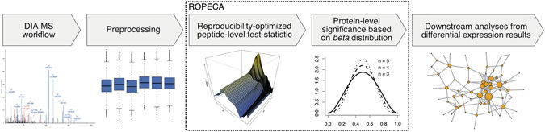
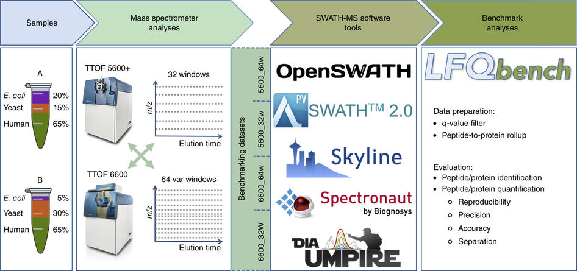
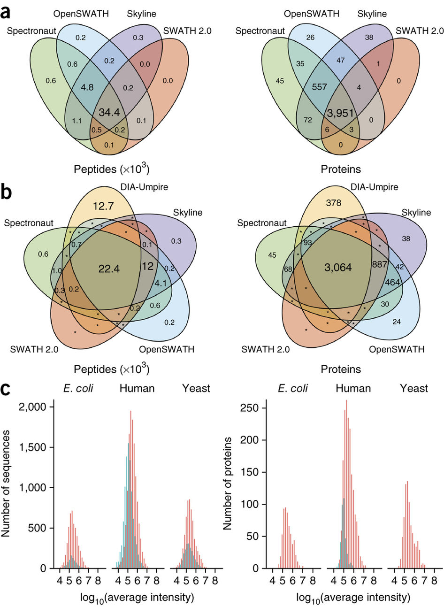
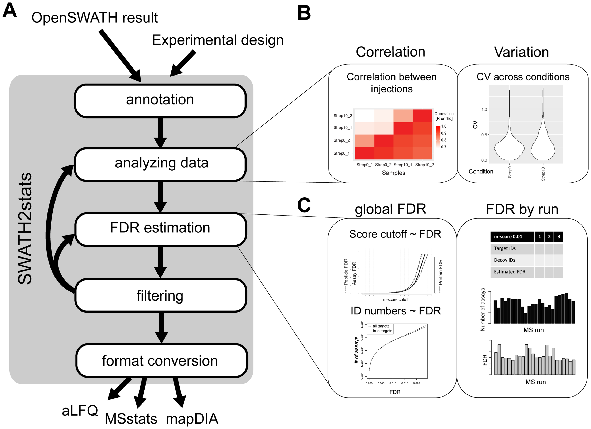

# Multigroup analysis

## Abstract

Idea is to provide an easy to use API to process and analyze Quantitative mass spectrometry data from different sources in R or python or maybee both.

The Aims are:

- Single configuration script, object allowing to specify filtering, imputation, normalization methods, models used, visualizations
- Generate output Report, including figure captions, in HTML and PDF format. Place all figures with reasonable naming in high res png and pdf in folders.
- Allow for variable column naming
     - change column names depending on input software and allow for meaningful column names for factors, conditions.
- Ensure that naming is consistent within analysis.
- Report p-values and adjusted p-values but more importantly report confidence or credibility intervals.
- Provide statistics of fold changes for multiple comparison experiments
- Support data on protein, peptide/precursor and transition level (likely peptide/precursor level only).
     - use filtering and aggregation on levels if statistics backend does not support those levels (e.g. limma)
- Support algorithms working on the precursor (MSStats and MapDIA), peptide (msqrob) and protein level (limma).
- Visualize up to 2 explanatory variables e.g. condition, patient. - This also means that the plots need to be annotated.
- Define comparisons using contrasts i.e. condition1 vs condition2
- Model fractionated experiments i.e. LOPID experiments
- Create meta analysis compatible summaries for each set of parameters. i.e. do not write results only to report but create an object with all the inforamtion. i.e. store number of proteins, peptides, sample correlations after each processing step.
    - Study parameter sensitivity - which step in the analysis changes the result most.
    - Create a set of Benchmark datasets.

# Comparable concepts {.tabset}

## MSqRob 


## TAPR


## ROPECA



[ROPECA](https://www.nature.com/articles/s41598-017-05949-y)

## LFQBench

An (not necessarily the best) example how to integrate different software and benchmark results.

[LFQBench](https://github.com/IFIproteomics/LFQbench)



## Swath2Stats

[Swath2Stats](https://bioconductor.org/packages/release/bioc/html/SWATH2stats.html)



# Nomenclature

- sample - a single mass spectrometric run
- sample Annotation - factors associated with this sample e.g. date, donor, condition etc.
- subject - the subject we want to learn about - e.g. Protein or peptide
- subject components - Proteins are made of peptides, peptides are aggregated from precursors
- response variable - intensity
- explanatory variable - fixed and random effects
- fixed effects - what we want to model e.g. condition.
- random effects - subject components, some of the sample annotation e.g. technical replicate


# Functionality:  {.tabset}

## QC and Summaries

### Annotation Summaries

* How many conditions, How many samples per condition (2x2 tables).

### Generate QC plots for the data

* Scatter plot within condition
    - on which level - Precursor, protein
    - on which condition if up to 3 conditions possible - main condition
    - `fzpq_gg_pairs`
* Pairs plot of group averages (output of modelling actually)
    - `fzpq_gg_pairs`
* Compare ordering of transitions, proteins between samples
    * Correlation plot for samples - on which level - precursor protein or on all?
    * Pearson, Spearman rank correlation, R or R^2
    * Compare clustering based on Correlation with that obtained from annotation.
    - `fzpq_gg_heatmap`
    * Clustering - heatmap, on not normalized and normalized data with condition labels:
        - specify which variables to encode - work out how to encode - color scheme.
* CV for each condition if N > 2 and overall.
    - How to interpret it in a paired experiment?
    - Maybe disable it? Or show 2 CV plots based on each condition variable.
    - more concise represnetation?
    * Violin - Densities within condition - before and after normalization
    - `fzpq_gg_cv`
* Intensity distribution within sample:
    * Compare condition based on common density - before and after normalization
    - `fzpq_gg_density`
    * How to compare 2 empirical distribution using on number?
        * Plot 5 number summaries - plot Q1, mean, median, Q3 for each sample.
        - `fzpqc_gg_summary("five")`
        * Use also moments mean, median, sd, Skewness, Kurtosis.
        - `fzpqc_gg_summary("moments")`
        * Show this summary before and after normalization.
        - `fzpqc_gg_boxplot`
* Summaries for NAs.
    * nr of NA's per sample on which level (precursor, protein)?
    * nr of NA's per precursor, peptide,
    - based on mice
        - `fzpq_cc` select complete cases and `fzpq_cci` complete case indicator
        - `fzpq_ic`	Select incomplete cases
        - `fzpq_ici`	Incomplete case indicator
* Peptide and transition Summaries
    * Summaries of Charge states
    * Nr of precursors per modsequence - min median mean and max - distribution - plot
    * Nr of mod sequences per peptide
    * Nr of peptides per protein
    * Nr of proteins with 1,2,3, or peptides / precursors
    - can be generated based on `subjectComponents` and their ordering.
* QC for Retention time (RT) only possible on precursor level data.
   * Plot pairwise precursor fold change vs RT.
   - `fzpq_gg_rtpairs`
   * Think about a summary for each pair?
      * Fit a loess line, moving average or spline. Report systematic deviations.
* MA plots on various levels
   * Log2 fold change vs intensity for precursors, aggregated peptides, and proteins.
    `fzpq_gg_ma` see also (ma on ggplot2)[https://gist.github.com/slavailn/172302c273b737b4219516c93173542c]
   * Summarize their distribution - interesting because fold changes on precursor level sometimes much higher than on protein level.
* QC of data filtering
    - use sample correlation
    - use transition and peptide correlation
        - option 1 : pass all matrices
        - option 2 : annotate rows with filtering results (place an indicator for each filtering)
              - I could use with for instance.

## Data preprocessing

* data filtering
    - based on intensity : top X transitions per precursor, top X precursors per protein
    - correlation based precursor or peptide filtering
         - can be performed on normalized and not normalized data. What is the consequence?
         - Measure which combines correlation and scale.
             - i.e. it does not matter if transitions not correlated if observed fold change are very small.
    - NA counting and removal, globally and per condition thresholds - how to specify it?
    - Q value filtering for DIA data (strongly related to NA filtering)
    - Protein filtering min X precursors, modified peptide sequences or peptides per protein
    - remove / keep not proteotypic peptides
* subject aggregation - (protein from precursors, and precursors from transitions)
    - using sum, mean median
* sample normalization
    
    - (vsn)[http://bioconductor.org/packages/release/bioc/html/vsn.html]
    - median
    - median and variance (robust scale)
    - quantile
    - Tuckey median polish, what for?: (how to compute)[https://www.youtube.com/watch?v=RtC9ZMOYgk8]
    - (cqn)[https://academic.oup.com/biostatistics/article-lookup/doi/10.1093/biostatistics/kxr054]
* Missing value imputation - must be used if aggregating is enabled and NA's in the data
    - sparse from Spectronaut
    - row mean and column mean imputation
    - linear regression
    - hot deck encoding
    
## Modelling

* Data modeling:
     * ANOVA
     * linear models
     * mixed linear models
     * external packages like `limma`, `msqrob`, `ropeca` (eventually MSStats) on the data.
* Local Model QC (for each protein)
    * boxplot per condition for each protein (unpaired)
    * matrix plot showing all precursors / peptides.
    * Show confidence intervals.

## Visualization of modeling results. {.tabset}

* Global for all proteins for 2 samples:
     * ma plot for each comparison - color code p-values?
     * volcano plot for each comparison (p-values, adjusted p-values)
     * distribution of p-values and distribution of adjusted p-values (FDR)
     * distributon of log2 fold changes - with lines marking 0, the median, mean, 1Q and 3Q of the distribution.
          * Include statistics about how many are less or greater than zero
* For multiple comparisons
     * Scatterplot matrix of fold changes
     * Correlation matrix for fold changes
     * Heatmap of significant fold changes - nice to see.
* Comparison of multiple analysis
     * Correlations of fc and p-values
     * ma plots
     * nr of differences (?)

# Open topics: {.tabset}

## Compare results for fold change obtained by:

$$
FC_{aggr} = \log(\frac{p^1_a+p^2_a + \dots + p^n_a }{p^1_b+p^2_b + \dots + p^n_b})
$$
$$
FC_{transitions} = f(\log(\frac{p^1_a}{p^1_b}), \log(\frac{p^1_a}{p^1_b}),\dots, \log(\frac{p^n_a}{p^n_b}))
$$

$f$ - could be median, mean, robust mean etc.
$a,b$ is the the sample
$1,2, \dots ,n$ is the precursor belonging to protein $p$.

For top 3 $n\le3$

## Protein inference problem

We measure precursor, but the subject is proteins. Precursors can be grouped in proteins. Either, unambiguously (N:1) no conflicting peptide protein assignments, achieved by removing all precursors matching more than one protein.  Optionally we can allow for ambiguity (N:M), which means that the same peptide can be assigned to more than one protein.

- Visualize profiles of proteins which have shared peptides.
- Protein Grouping problem -> Visualize protein profiles of grouped proteins.

# Implementation {.tabset}

## Naming conventions and programming paradigms

- Use long format (tibble or pandes) 
- use `tidyverse` (or pandas) `plyr`, `dplyr`, `tidyr`.
- (Programming with dplyr)[http://dplyr.tidyverse.org/articles/programming.html]
- implement functions to switch between long to wide `to_wide` - pivot.
- functions to switch from wide tolong `to_long` - difficult since wide can't cary the same amount of information?
   - If yes the wide representation needs to store the more of information in an additional attribute?
   - could be usefull for some filtering approaches.
- Use an additional object which describes which columns means what?
    - additional attributes e.g. `Subject`, `subjectComponents`
    - Store it as an attribute.
    - If this works additional table types like peptide protein are not needed, the right method is chosen by examining the _special_ attributes
    - methods work on _tibble's_ and should support _magrittr_ operator
    - see also : (sf)[https://github.com/r-spatial]
- Optional tibble to represent annotation if annotation largish.
- function naming: `<package>_<datatype>_<functionname>`
  - function naming should finding function simpler
- would spliting into packages help?
   - base - `fzpb_d_towide()`
   - quality control - `fzpqc_gg_pairs()`
   - filtering - `fzpf_d_correlation`
   - modeling - `fzpm_d_limma()`, `fzpm_g_volcano()`
   - modeling comparison - `fzpmc_d_ma()`
- datatypes returned by functions can be:
  - data.frame `d_`
  - or ggplot2 objects `gg_`
  - matrices - `m` wide format


## Configuration {.tabset}

### Filtering and Aggregation

What variables are needed for filtering?

Aggregation and filtering works between subjectComponent and subject or 2 subjectComponent levels.
Uses information from the `subjectComponents`.


- fixed effects, mayor effect e.g. condition, donor, sex
- subject e.g. Subject = TopProteinID or Subject = StrippedPeptideID or Subject = ModifiedProteinSequence
- subjectComponents e.g. Level_0 = "strippedSequence", Level_1 = "modifiedSequence", Level_3 = c("modifiedSequence", "charge", "precursorID")
- Specify `Response = "vsnIntensity"`

__Examples:__

Describe levels,

```{r}
Effects = list(c("Strain", "Treatment", "TimePoint"), "PatientID", "isFemale")
```

If not named that create name by using default separator "_". E.g. Strain_Treatment_TimePoint
If named than use this name.

```{r}
Effects = list("Condition" = c("Strain", "Treatment", "TimePoint"), "Donor" = "PatientID", "Sex" = "isFemale")
```


Open issue: How do we merge the Condition columns into a new condition identifier?
Needed for specifying contrasts.


A peptide measurment experiment

```{r}
Subject = "modifiedSequence"
SubjectComponents = list("Precursor" = c("modifiedSequence", "charge", "precursorID"))
```

Order matters. The first entry in the list fixedEffects is the mainEffect.


A protein Measurement experiment

```{r}
Subject = "ProteinID"
SubjectComponents = list("Peptide" = c("nakedSequence"), "ModifiedPeptide" = c("nakedSequence", "modifidPeptideSequence"))
```

Similarily for experiments containing Precursor information.

### Modelling

What configuration is needed for modeling?

We want to learn about proteins, therefore we need to specify:

```{r}
Subject = "ProteinID"
fixedEffects = c("Condition", "Donor")
randomEffects = c(SubjectComponents, "Sex" = "isFemale")
Response = "vsnIntensity"
```

This model syntax would translate to:
``` vsnIntensity ~ Conditon + Donor ```

Open issue is than still. How do we model interactions?

What might work is:
```{r}
fixedEffects = c("Condition", "Donor", "Donor:Contion")
```

The ProteinID is here the grouping variable. Obsolete columns can be e.g. __Fasta.headers__ containing additional information. But obsolete can be also original intensities if transformed intensities are used. The transformed intensity will be the response. We limit the number of fixed effects to 3.

Do we need to specify those columns?

```{r}
ObsoleteColumns  = c("FastaHeaders") #(but required to be cept)
```


__Specifying contrasts__


### Plotting 

What configuration is needed for plotting?

Most of the plots will work with the long format (ggplot2) but some of the plots need the data in a wide format (e.g. pairs plot).


## Model evaluation and visualization

Modelling from limma, MSqRob, and others are results are respresented as `tibble`. Good place to start with is the r-package [broom](https://github.com/tidyverse/broom).

## Code example

```{r, eval=FALSE}
res <- 
  read_tsv(tsvfile) %>% 
  fzb_df_add_config(ymlfile)

res %>%
  fzbq_gg_cvplot()

res %>%  fzbq_gg_pairs("condition")

# aggregates top 3 transitions
resPeptide <- res %>% fzbf_df_aggregate(top=3,median)

# returns a dataframe with model annotation.
modelres <- res %>% fmzbf_m_MSqRob() 

```


# Output {.tabset}

Some of the data are of bigger importance to the end user and therefore need to be splitted into sever tables.

## modelling results

    - Pipeline (e.g. limma)
    - Subject (protein ID)
    - obsolete columns (i.e fasta.headers).
    - Contrast (e.g. T1-T2)
    - foldChange - log2Ratio
    - averge intensities in both conditions (e.g. avgT1, avgT2)
    - p-value
    - adjusted-pvalue
    - Confidence interval
    - Bayes Factor

## subject statistics
    - Subject
    - nr of peptides (-subjectComponent0, -subjectComponent1)
    - nr of precursors
    - nr of precursors to start with
    - subjectComponent QC measures (how well the transitions were correlated over the samples)
        - _avg_, _min_ and _max_ correlation
    

## transformation results
    - Subject
    - Sample
    - Intensity
    
## Reports - Figures
- Reports
    - html
    - pdf
- Figures
    - pdf
    - png


# Types of input data

- MaxQuant ProteinGroups.txt , Peptide.txt
- Spectronaut
- PD - LFQ workflow
- OpenSwath

The outputs come in various formats, not necessarily in long format (e.g. MaxQuant). Therefore, scripts converting those outputs in long format are needed.
 

# Evaluation {.tabset}

## Filtering
* How filtering is influenced by the number of samples/conditions?
* How one filtering step can influence a different filtering step? E.g. stronger $qValue$ filtering might increase the number of proteins left because more are kept after correlation filtering.

## Output storage location

In addition to the input also the output location must be configurable. Furthermore, the working directory also needs to be adjustable.


## Intermediate results

Do we also need to export all intermediate results and if which one?
   - table with top 3 peptides
   - results of correlation filtering?


# Example Projects {.tabset}

## Benchmar datasets

Check with Pedro Navarro if triple proteome datasets are available for various instruments.

[Triple proteome - Tripel proteome](https://www.ncbi.nlm.nih.gov/pubmed/25545627?dopt=Abstract)
[Triple Proteome Data Pride](ftp://ftp.pride.ebi.ac.uk/pride/data/archive/2017/04/PXD001240)

[LFQbench - Triple Proteome](http://www.nature.com/nbt/journal/v34/n11/full/nbt.3685.html)
[LFQbench  - Data](http://proteomecentral.proteomexchange.org/cgi/GetDataset?ID=PXD002952)

[Spike in Benchmark dataset - Bruderer](https://www.ncbi.nlm.nih.gov/pmc/articles/PMC4424408/)
[Data at Peptide Atlas](https://db.systemsbiology.net/sbeams/cgi/PeptideAtlas/PASS_View?identifier=PASS00589)


## Example project Fabienne Cells.

## Example project 2147

factors - levels

* Raw.file
* Measurement.Date
* Measurement.Order
* Strain
* Timepoint
* Treatment
* Plant
* Leave
* BATCH


# Nomenclature

## For modelling {.tabset}

A proteomics measurement might look like:

* FileName
* TransitionGroupID
* StrippedSequence
* ModifiedSequence
* PrecursorCharge
* Decoy
* LabelType
* Measured.PrecursorMZ
* Measured.PrecursorRT
* Measured.PrecursorScore (some arbitrary quality score).
* Measured.MS1Intensity
* Measured.MS2IntensityAggregated

### Fixed effects

interesting to the analysis

* Condition (Strain + Timepoint + Treatment)
* Since the experiment is paired we also need plant as an additional factor

For instance

- sample name
- sex
- condition
- donor


### Random effects

Of no interest to the analysis, e.g. the batch. If we move to protein level it will be peptide or precursor.

For instance : Protein Level Annotation

We are interested in inferences on the protein or protein groups level usually.

* Nr.Peptides
* Majority.protein.IDs (all proteins belonging to a protein group. See protein grouping  <http://aggrivet.blogspot.ch/2016/12/protein-clusters.html>.
* Top.Protein.Name - label protein of the protein group
* Fasta.headers (additional protein annotation)


### Contrasts

Are computed based on a single factor e.g. condition. Which can be a composition of several factors (see above).

## For Filtering {.tabset}

### Subject Levels

### Sample Annotations


# References

[TRAPR: R Package for Statistical Analysis and Visualization of RNA-Seq Data](https://www.ncbi.nlm.nih.gov/pmc/articles/PMC5389949/)

[Visualization of proteomics data using R and Bioconductor](http://onlinelibrary.wiley.com/doi/10.1002/pmic.201400392/full)

[limma](http://bioconductor.org/packages/release/bioc/html/limma.html)

[MSStats](http://msstats.org/)

[MSqRob Summarization vs Peptide-Based Models in Label-Free Quantitative Proteomics: Performance, Pitfalls, and Data Analysis Guidelines](http://pubs.acs.org/doi/abs/10.1021/pr501223t)

[MSqRob github](https://github.com/statOmics/MSqRob)

[Benchmark data for MSqRob](https://github.com/statOmics/MSqRobData/)


[VSN A systematic evaluation of normalization methods in quantitative label-free proteomics.](https://www.ncbi.nlm.nih.gov/pubmed/27694351)


